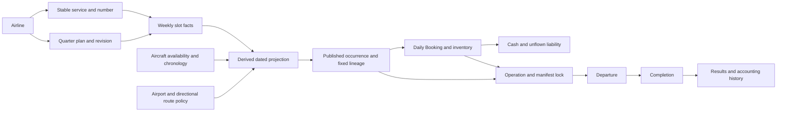

# Quarterly Dependency, Ownership and Validated-Command Contracts

Stage 2E successor (2026-10-09): [transaction certification](Quarterly%20Transaction%20Certification.md)
adds command-matrix reference comparisons, independent index/number witnesses and
adversarial boundary coverage. Final focused/regression and full verification pass;
no production changes were necessary. All four gates and both world
copies remain. Earlier checkpoint limitations below are historical; quarterly
activation, Stage 3 and transaction-copy optimization remain separate scope.

Stage 2D successor (2026-10-08): [maintained inverse indexes and freshness](Quarterly%20Maintained%20Dependency%20Indexes%20and%20Freshness.md)
are implemented for dormant Scheduling-owned dependencies. Stage 2C proof/gates remain;
2E and quarterly activation remain pending. Earlier checkpoint limitations below are historical.

Stage 2C successor (2026-10-08): [dormant feasibility and chronology](Quarterly%20Feasibility%20and%20Chronology.md)
now implements affected aircraft-chain proof and explicit continuation/edit/removal/retirement
commands. Stage 2D/2E and quarterly activation remain unimplemented; earlier checkpoint
limitations below are historical.

Stage 2B successor (2026-10-08): [restricted dormant commands](Quarterly%20Restricted%20Command%20Foundation.md)
implement bundled service/initial-frequency creation and fare-only revision through
session-issued prepare/apply boundaries, isolated validated candidates and detached
results. No executable feasibility, maintained index, transaction certification or
quarterly activation. Next is 2C; prior checkpoint statements below remain historical.

Schema 9 successor (2026-10-08): [flight-number reuse authority](Quarterly%20Flight%20Number%20Reuse%20Authority.md)
now implements protected historical display-number reuse and global retained endpoint
consistency using unchanged fields. Stage 2A reads remain compatible. Statements below
about unchanged Schema 8 or the next schema prerequisite describe this record's original
checkpoint; the next unimplemented slice is 2B. Quarterly workflows and commands
remain dormant; 3G-C remains PARKED.

**FINALIZED CONTRACT DESIGN — STAGE 2A–2D IMPLEMENTED; 2E CERTIFIED**

Stage 2A successor (2026-10-08): [read implementation](Quarterly%20Dependency%20Read%20Foundation.md)
adds direct selected-reference ownership/dependency resolution, recursively immutable
reads and a session entry point. Endpoint checks cover explicitly selected versions only;
no global Schema 8 invariant, command, index or consumer migration. Earlier finalization
statements below retain their historical scope; schema-first reuse work remains next.

Prepared 2026-10-08 from the restored Stage 1 checkpoint
**f079c5dfcaff216d4aad5c2984f2bca7787116e6**. Fetch succeeded; local HEAD,
upstream and origin/master matched that revision. Tracked working tree and index
were clean; only pre-existing `.venv/` was untracked before this document.
The archived unfinished Stage 2 stash was not inspected, applied or used as authority.

Finalized 2026-10-08 using explicit product decisions: reusable retired display numbers,
eligible-quarter Manual Publish/target advancement, publication before same-boundary
Booking and atomic failure/pause/correction/retry supersede earlier provisional/open
items. Canonical product and decision/status documents are updated with clear future
scope. Schema 8, template, production, tests, data and runtime remain unchanged. No
slice or workflow is implemented. The documentation-only checkpoint records these
reviewed contracts without implementation authorization. The schema-first implementation
recommendation below is a future prerequisite, not changed current schema authority.

## Authority, evidence and scope

Persistent naming/shape follows [AGENTS.md](../../AGENTS.md):
[canonical schema](Stage%201%20State%20Schema.md#quarterly-migration-stage-1-authority-foundation-schema-8)
first, [template mirror](../../Data/Templates/template_reference.txt) second.
The [folder reference](../../Data/Templates/foldertree.txt) is selective;
approved ownership and the current tracked tree govern placement.
The [canonical quarterly design](../01%20Core%20Simulation/Quarterly%20Planning%2C%20Weekly%20Services%20%26%20Bounded%20Booking%20Architecture.md)
defines future product direction. This document adds proposed technical contracts,
not a competing persistent schema or permission to implement.

Context reviewed: [Stage 1 implementation](Quarterly%20Authority%20and%20Identity%20Foundation.md),
[status](Current%20Development%20Status.md), [roadmap](Stage%201%20Implementation%20Roadmap.md),
[decisions](Decision%20Register.md), and the [migration audit with supersessions](Quarterly%20Weekly%20Architecture%20Migration%20Audit.md).
Domain context includes [Scheduling](../01%20Core%20Simulation/Flight%20Scheduling%20Architecture.md),
[Demand/Booking](../01%20Core%20Simulation/Passenger%20Demand%20Technical%20Specification.md),
[Acquisition](Aircraft%20Acquisition%20Technical%20Specification.md),
[Save](Game%20State%20%26%20Save%20Technical%20Specification.md),
[GUI/session](PH%20GUI%20Foundation%20Technical%20Specification.md),
and recorded [3G-A](Runtime%20Scalability%20Forensic%20Audit.md) /
[3G-B](Runtime%20Local%20Certified%20Proofs.md) findings.
Source tracing is contextual; no new benchmark or gameplay execution was needed.

| Current evidence | Implemented fact relevant to the design |
| --- | --- |
| [quarterly_construction](../../game/world_state/quarterly_construction.py), [quarterly_validation](../../game/world_state/quarterly_validation.py) | Three dormant roots: `services`, `service_numbering`, `weekly_plans`. Constructors mutate caller-owned candidates. Expected revision and commitment checks exist, but no public command transaction or complete weekly feasibility exists. Plan uniqueness currently scans plans. |
| [quarters](../../game/utils/quarters.py), [service_identity](../../game/scheduling/service_identity.py), [foundation tests](../../tests/test_quarterly_foundation.py) | Central UTC quarter/target arithmetic; deterministic service/date/slot key; derived number/lifecycle; tests cover continuity, multiple frequencies, retirement, exact persistence and unchanged legacy operation. No occurrence table or publication action. |
| [weekly draft](../../game/scheduling/weekly.py), [session](../../app/session.py) | Schedule Builder saves explicit transient legs through current-world revalidation into legacy schedules/publication. Draft copies/fingerprints and positional UI intent are not new service identity. No quarterly consumer entry point exists. |
| [publication](../../game/scheduling/publication.py), [recurrence](../../game/scheduling/recurrence.py), [dated indexes](../../game/scheduling/indexes.py) | Legacy effective-dated revisions expand to allocated flights with schedule/date occurrence keys and Departure events. Configured scheduling default is 90 days; normal rolling publication is roughly 28–35 days, not 365. |
| [Booking shopping](../../game/booking/shopping.py), [checkpoint](../../game/booking/checkpoint.py), [Booking indexes](../../game/booking/indexes.py) | Current desired-date offsets are inclusive 0..365. Supply discovery rebuilds dated-flight indexes; aggregate bookings/itineraries reference dated IDs and legacy schedule lineage. Inventory and finance revisions protect sales. |
| [fleet entry](../../game/fleet_management/acquisition.py) | Purchase enters individually owned aircraft at the selected eligible base/hub immediately. Registration is display only. No delayed future-availability timestamp/location/provenance contract exists yet. |
| [fulfilment](../../game/aircraft_operations/fulfilment.py), [kernel](../../game/simulation/kernel.py) | Departure locks manifest/operation and creates causal Completion. Results retain actual facts and accounting links. Exact persisted event order and rollback remain authoritative. |
| [persistence](../../game/world_state/persistence.py), [owned reads](../../app/owned_reads.py) | Disk Load requires Schema 8, validates a separate candidate, rebuilds queue, restores paused. Session trusted reads rely on exclusive ownership; foreign rebinding reacquires full validation. Runtime read indexes are disposable. |

## Executive architecture recommendation

Keep service identity owned by the airline, weekly planned facts owned by immutable
quarter-plan revisions, and commercial/operational obligations owned by one dated
occurrence identity with fixed publication lineage. Mutations enter through validated
domain commands serialized by the application owner. Maintain the relationships needed
to find the complete affected closure; do not reconstruct them from world/history on
every request. GUI consumers receive detached immutable projections.

The quarterly foundation remains dormant until an explicit operational cutover. Existing
Schedule Builder, recurrence, dated flights, Booking365, events, acquisition, finance,
history and GUI remain the sole implemented operational system. There is no dual supply
writer, implicit mapping of existing schedules to services, or operational use of
`weekly_plans` merely because those fields now exist.

### Approved product decisions and current gaps

- UTC quarters and months 1–2 next-quarter targeting are fixed. The intended final-month
  publication dates are March/June/September/December 1 at 00:00 UTC; planning then moves
  to the next eligible unpublished quarter. Airport-local flight conversion remains.
- Only published/committed supply may eventually be commercially eligible. Publication
  is necessary, not sufficient: date, route, airport, capacity and status checks remain.
  Current 0..365 Booking rules remain until separately approved migration.
- PH 1.0 ordinary published edits are locked; there is no approved unpublish command.
  Actual operations can deviate without erasing the scheduled plan. Amendments are deferred.
- Carry-forward is the normal baseline; no action should not erase future service.
  New airlines use future-quarter planning, with early manual commitment, including
  the approved month-3 initial quarter-after-next target. No partial-current-quarter exception.
- **Changing either directional endpoint requires NEW service ID and a policy-allocated flight number.**
  Non-endpoint changes may preserve identity only subject to lifecycle protections.
  This user-approved clarification is not enforced across versions by the committed
  Stage 1 validator. Endpoints currently live in slot facts, not on the service root.
  Before a future mutation API relies on endpoint continuity, its implementation scope
  must update schema semantics/mirror and validation deliberately. Nothing is changed here.
- Service IDs remain permanently reserved. Display-number reuse is now approved once
  protected schedule use ends; the lowest eligible retired suffix precedes the next new
  monotonic suffix. Preserve continuing numbers and never compact survivors. Current
  Schema 8 still forbids reuse; that provisional implemented assumption is superseded
  for future design only. Plan removal is not global retirement or cancellation.
- The currently eligible unpublished quarter can commit manually before its automatic
  date. January Q2 Manual Publish locks/opens Q2, retains April 1 operating start and
  advances planning immediately to Q3. Already committed quarters cannot be edited,
  republished or cause target regression at their normal automatic date.
- Publication/readiness commits before boundary Booking observes supply. Automatic
  failure pauses visibly for correction and deterministic retry; no partial commitment,
  silent removal/repair or advancement past the failed publication fence.
- AT-026 already defers configuration-history authority until reconfiguration. Future
  facts must not reinterpret retained operations through current configuration alone.
  Existing quarterly validation currently compares retained slots to installed aircraft
  configuration; do not weaken it or introduce speculative state in this design task.
- Future availability must be authoritative time/location/provenance, not a planner
  promise. Immediate acquisition remains current behavior; no extra guarantee philosophy
  or teleportation is approved.
- Preserve daily directional demand, progressive sales, capacity-not-demand, advance
  cash/liability posting, subsequent revenue recognition, lossless history and no offline
  progress. Old development-save conversion is not required.

Normal UTC targeting is a starting point, not a persisted redundant label: skip already
committed eligible quarters in chronological order to find the next unpublished target.
Publication and operating start stay distinct. March 1 Q2 commitment does not stop Q1
operations; April 1 activates Q2. Early January Q2 commitment advances planning to Q3
immediately. Carry-forward is editing by exception, not compulsory physical duplication;
use the applicable preceding published version (early-published Q2 is Q3's baseline),
preserving explicit identities rather than reverting to older active-quarter facts.
Further eligible early commitments may change which periods are published; no arbitrary
quarter picker, always-active-plus-next bound or rolling 365-day cap is inferred.

Publication failure retains the failed unpublished plan for correction/retry and blocks
progression past its pending fence. Correction targets that plan with ordinary identity/
ownership/feasibility protections; already published plans remain immutable. Later event/
save contracts must retain any nondeducible pending correction/retry facts without allowing
partial exposure. Exact GUI, priorities and work slicing are implementation concerns,
not permission to change publication-before-Booking or safe atomic failure behavior.

## Ownership and identity lifetime contract

References are not ownership transfers. Display labels, GUI selection and parsed
occurrence strings never establish sufficient ownership proof.

| Entity | Owner and sufficient direct proof | Canonical identity | Lifetime / protection |
| --- | --- | --- | --- |
| Airline | World/career; resolve actual airline record and controlling session scope | Airline ID | Retained financial/operational responsibility |
| Quarter plan | Airline; plan `airline_id` equals command owner | `weekly_plan_id`; unique airline/quarter pair | Planning to retained history; owner/quarter fixed |
| Revision | Resolve revision under its plan, verify number/key coverage | Plan ID + revision | Prior facts immutable; append before commitment only |
| Service | Airline directly; service `airline_id` equals owner and referenced plan owner | `service_id` | Stable across allowed continuations, retained after retirement |
| Flight-number allocation | Airline; numbering/holder relations proven through service IDs and live references | Airline ID + numeric suffix; rendered text is display, not historical key | Continuing/draft/protected holders exclusive; eligible retired suffix may be reallocated to NEW service; historical assignments retained |
| Slot/frequency | Service identity, with planned facts owned by revision; require membership and service/plan owner equality | Service ID + stable slot number, qualified by plan/revision for facts | Edit explicit continuing frequency; new frequency allocates new slot |
| Aircraft assignment | Plan slot references canonical aircraft; aircraft owner must equal plan/service owner | Aircraft ID | Reference, not ownership transfer; actual location/contract remains Fleet authority |
| Airport / market | World/content; resolve airport IDs, connection's actual directional market/endpoints | Airport ID / market ID | Shared reference; market demand is not owned by schedule |
| Airline connection | Airline; connection owner equals plan/service owner | Connection ID | Route participation references world market |
| Dated occurrence | Service's airline; resolve commitment/lineage back to service and plan, verify date/slot applicability | `service_id@origin-local-date#slot_number` | One commercial/operational identity; string parsing alone insufficient |
| Published commitment | Selected plan revision's airline; commitment lineage and fixed facts agree | Plan/revision plus dated identity where materialized | Timestamp persists, lifecycle derived; no ordinary rewrite |
| Inventory / Booking obligation | Operating/selling airline proven by occurrence/itinerary lineage | Dated occurrence + inventory revision; Booking/itinerary IDs | Progressive sales; cannot be deleted at rollover while obligations remain |
| Operational outcome | Occurrence lineage and actual operation; validate aircraft and event owner relationships | Dated identity plus operation/result links | Actual facts evolve; finalized results retained |
| Event | Simulation queue with validated domain owner reference | Event ID, persisted ordering, operation revision | Pending then processed/cancelled/superseded evidence |
| Accounting/history | Airline accounts and source transactions/results; equality against source owner | Transaction/result IDs with dated/service lineage | Posted/finalized facts retained losslessly |

Existing records sometimes repeat airline IDs for direct lookup/reporting. Such values
must agree with the authoritative owner chain; they are consistency witnesses, not
alternative owner selection. Avoid adding owner fields to slots solely for convenience.
For market-wide Booking, legitimate competition includes other airlines; locality does
not mean incorrectly isolating the selected airline's offers.

The endpoint rule applies to all frequencies and quarterly versions of a service.
MNL→DVO cannot become MNL→CEB or CEB→DVO under the same service identity.
Prefer a future cross-reference invariant over existing retained slot authority, with
a rebuildable service-to-endpoint consistency lookup, over duplicated endpoint fields
unless implementation evidence requires new authority. Rebuild must reject conflicting
retained pairs, never pick whichever row was encountered first. An unreferenced Stage 1
service is not evidence of a route; a future command must bind its first accepted facts
explicitly and atomically. This is a technical recommendation, not a schema amendment.

Continue by explicit service/slot references; never match by row, route similarity,
mutable fingerprint or display number. A new distinct frequency uses a new slot; a
continuing frequency preserves its slot. Multiple weekdays may share one slot. Endpoint
replacement allocates a new service and policy-selected number, and applies old-service removal/retirement
only under the lifecycle policy; it cannot implicitly cancel current/sold operations.
Historical service meaning and assigned display labels remain even when no future plan
uses it; a released label may be allocated to another new identity under the rule below.

## Finalized number lifecycle and future schema-first prerequisite

Service IDs are never reused. A service's stored numeric suffix remains its historical
label even when another, later service receives that same suffix. Number allocation is
per airline with the fixed prefix; number ownership is resolved by canonical service/
plan references, not by parsing display text. No continuing service is renumbered.

Protected use includes all active, published and future-committed plan memberships of
any service assigned that airline/number pair. Retiring the service or removing it from
one draft does not override any such membership. Plan removal changes only that future
version; global retirement prevents future continuation, preserves historical/committed
references and cannot cancel outstanding carriage or accounting. Historical-only use
does not itself block reuse. Completed operations remain inspectable under old IDs.

Allocation contract: continue existing identity/number; otherwise reserve the lowest
eligible retired numeric suffix, or, if none exists, reserve `next_number` and increment
it. Reuse does not increment/rewind the high-water cursor. The set is per airline,
deduplicated and numeric, not lexicographic. New service ID allocation remains monotonic
regardless of whether its displayed number is new or reused. All reservations/cursors
commit atomically with the new service; failure consumes nothing.

An unpublished new-service allocation is an exclusive draft reservation. It must not be
immediately reused just because it has not published. Likewise, a still-continuing draft
cannot lose its number as a side effect of another create request. Plan-local removal
alone is not release of a still-live service identity. Confirmed global retirement ends
that continuation/reservation, but number eligibility still waits for protected committed
memberships to end. This is allocation correctness, not an added cooldown or a new rule
that historical records must be deleted. A retired-number pool is a maintained derived
set of safely released numbers, not a second authoritative history ledger.

### Exact current Schema 8 conflict

| Current field/implementation | Conflict with approved future reuse | Required later contract change |
| --- | --- | --- |
| `services.flight_number_number` and retained records | Every service retains a suffix; validator's `used` set rejects `(airline_id, number)` duplicates across ALL retained services, including retired/history | Permit historical reassignment to distinct service IDs while enforcing exclusive current reservation/protected use; never overwrite an old assignment |
| `services.retired_at_utc` | Global retirement timestamp does not alone prove absence of committed references | Combine retirement/reservation state with validated live/committed membership; retain exact old facts |
| `service_numbering.next_number` | `create_service` always chooses/increments next number; validator requires it exceed every retained suffix | Keep cursor as high-water mark; choose eligible retired suffix before fresh allocation; preserve existing maximum bound |
| Exact root/record fields and template comments | No stored pool exists; schema/template explicitly say numbers never reused | Amend semantics/mirror explicitly before code; do not introduce undocumented pool keys |
| Stage 1 tests/save contract | Unique lifetime numbers and current-schema-only disk interpretation are intentional witnesses | Add reuse/reservation/history/roundtrip witnesses and deliberate new-version rejection; do not silently reinterpret Schema 8 |

**Minimal representation recommendation:** existing authoritative service ID, airline,
suffix, retirement timestamp, per-airline high-water cursor and retained plan/revision/
publication references can represent this rule. A nonretired service is a current/draft
reservation; a retired record's suffix is eligible only when no live reservation or
protected plan reference owns it. Several retired records with the same historical suffix
produce one pool candidate. An active/future-committed retired service still blocks reuse.
No additional authoritative field/table is demonstrated necessary. Reconstruct derived
number-holder/protected-use/eligible-pool relationships at validated New/Load boundaries;
maintain affected deltas on allocation, retirement, plan/revision/commitment and quarter
transitions. Rebuild rejects conflicting live holders rather than silently choosing one.
If later implementation reveals a required nondeducible release fact, stop and propose
only that minimum schema fact before code; do not assume such a fact now.

**Recommend Schema 9 for the later reusable-number authority change**, even if record
shapes remain the same. The validator/save meaning changes materially: a reused-number
world accepted under the new contract is invalid under Schema 8's lifetime uniqueness.
Keeping version 8 merely because no keys change would mislabel that contract. This is a
future recommendation, not a current version bump. Development-save conversion is not
required; reject incompatible older files cleanly, construct coherent new careers and
preserve exact event-boundary/paused-load safety.

Ordering for implementation: canonical schema semantics/version first → subordinate
template mirror (new version, historical suffixes versus live reservations, pool derived,
selection/high-water rules, endpoint invariant) → production construction/validation/
versioned New/Load → tests/fixtures/docs. Canonical schema and mirror remain unchanged
in this task. Endpoint continuity must be covered by that implementation's authority
work too; number reuse does not permit historical endpoint reinterpretation.

The smallest safe ordering is **2A unchanged, then the small schema-first prerequisite
inside/before 2B's allocating command work**. Read-only 2A neither needs Schema 9 nor
allocates numbers, and must accurately report current permanent-reservation semantics.
Do not broaden 2A into allocation/validation migration. The narrow holder/pool lookup
needed for correct reusable allocation is a prerequisite to that command, not permission
to implement all 2D indexes; no per-allocation world/history scan is acceptable.

## Dependency graph and affected closure

Authoritative sources: plans/revisions/slots, services/cursors, aircraft/operations,
airport/connection/market policy, commitments/inventory, bookings and finance.
Derived state: projections, inverse membership, chronology and eligibility lookups.
Historical authority: retained plan lineage, finalized results and posted journals.
UI state: selections, previews and read tokens; no simulation ownership.

Closure uses **both old and proposed-new references**. A change starts with requested
records, expands through inverse/temporal dependencies, and stops only where unchanged
immutable meaning or unchanged readiness/location is proven. A direct-reference read
is not proof of absent conflicts, full feasibility, editability or authorization to publish.
Sorted canonical IDs and exact UTC intervals define deterministic traversal/results.

In the table: W=authoritative writes, D=direct reads, R=reverse relationships,
T=temporal closure, B=immutable stop boundary, I=derived state affected.
P means the explicitly selected plan/revision; A-old/new are both aircraft assignments;
F means resolved fare/capacity/timing and airport/route facts. No symbol is a schema field.

| Operation | W | D | R | T | B / I / scans excluded |
| --- | --- | --- | --- | --- | --- |
| Create service | Service/number cursor, optional initial slot/P revision | Owner, allocation cursors, endpoint facts if supplied | Airline/quarter uniqueness and endpoint binding lookup | Initial assignment if bundled | B: unrelated services/history; I: identity/membership; no all-aircraft/number reconstruction |
| Add frequency | Slot cursor and new P revision | Service/number, endpoints, F, A-new | Service memberships and aircraft reservations | Inserted interval, predecessor/successor and quarter/week edges | B: unchanged stable chronology; I: membership/chronology/supply projection; no historical-flight scan |
| Remove frequency | New P revision excluding slot | Selected slot/service | Reservations/memberships losing that slot | Reconnect predecessor/successor; extend if location/readiness changes | B: retained old revision untouched; I: live membership/chronology; no delete of history |
| Change weekdays/pattern | New P revision | Existing identity, old/new dates, F, A-old/new | All affected aircraft intervals, service slot membership | Removed and added dates, weekly wrap, DST, quarter edges | B: unaffected fixed facts; I: projections/chronology; no world recurrence re-expansion |
| Change departure time | New P revision | Local time/fold, old/new UTC conversions, timing, A-old/new | Reservations touched on both sides | Preparation, overlap, overnight and downstream positioning chain | B: first proven unchanged readiness/location; I: time indexes; no fixed-neighbor shortcut |
| Change fare | New P revision | Owner currency, integer fare, existing identity | Draft commercial projections using version | No operational chronology expansion when times/capacity unchanged | B: immutable published facts; I: relevant projected offers; no repeat geometry/world validation solely for price in the target proof |
| Assign/change aircraft | New P revision | Both aircraft owners/configs/availability and F | Reservations/operations/contracts on both aircraft | Remove old/add new, predecessor/successor and boundary chain | B: unchanged aircraft state beyond closure; I: reservations; no all-fleet scan |
| Continue into future quarter | Destination plan/revision, existing service/number/slot refs | Explicit source version, destination expected version, endpoints/F | Target memberships and affected aircraft reservations | Both quarter boundaries and UTC/local applicability | B: immutable source version; I: future plan/chronology; no semantic matching/history reconstruction |
| Remove service from future plan | New P revision without selected service slots | P and service | Selected memberships; other plans remain distinct | Union of removed-slot temporal closures | B: current/published/history facts preserved; I: live membership; no automatic global retirement |
| Retire service | Retirement timestamp under approved preconditions | Service owner, number reservation | Editable/current/future commitments referencing it | Relevant effective use dates, not lifetime history | B: sold/committed obligations retained; I: continuation availability; no cancellation or cursor rewind |
| Replace endpoints | New service/number and future P revision, policy-scoped old removal | Old/new endpoints/markets/F, owners/cursors | Old/new reservations and memberships | Union removal/insertion chains | B: old identity meaning immutable; I: both route/aircraft/market lookups; no old-ID route mutation |
| Replace whole editable revision | One new contiguous revision/current pointer | P and canonical supplied slots | Union of added/removed/changed slot dependencies | Union relevant chronology, duplicate/weekly-wrap checks | B: unchanged facts protected; I: matching deltas; no copy of unrelated world into revision |
| Publish later | Commitment plus necessary coherent supply | All affected quarter slots/F/availability/publication fence | Neighboring commitments and occurrence-key uniqueness | Start/end and same-time Booking boundary | B: fixed selected version; I: published supply/open window; no unrelated history rebuild |
| Booking eligibility/sale later | Checkpoint/bookings/itineraries/inventory/accounts | Due markets, published offers, revisions/fare/capacity | Competing supply, selected obligations/account sources | Current time/horizon/tolerance and service eligibility | B: immutable sale/plan lineage; I: market/date/inventory; no all completed Booking discovery |
| Departure/Completion later | Selected event, operation/aircraft, manifest/result/settlement | Fixed occurrence facts, actual aircraft, confirmed obligations, account revisions | Relevant manifest IDs/current event relationships | Actual readiness/causal event due order | B: committed strategy/history protected; I: live operation/queue/inventory; no latest planning revision search |

The minimum temporal neighborhood is not always two rows. A changed arrival location
can affect subsequent movements until identical location/readiness is established.
Include pre-departure preparation, turnaround, positioning feasibility, overnight legs,
weekly wrap and adjacent quarters. Origin-local dates can sit outside the UTC quarter's
calendar dates while departure lies inside it; use the Stage 1 conversion/membership rule.
Retained historical rows may anchor a finalized initial location, but absence/conflict
proofs must use current state and relevant reservations, not scan the airline's history.

A plan-only edit does not mutate Booking or finance; its commercial projection is still
unpublished. An aircraft/airport/connection mutation outside Scheduling invalidates the
affected reverse relations too. A published strategic plan being stable does not freeze
inventory, actual aircraft state, operational eligibility or exceptions. Full-world
validation remains unchanged; later local proof claims need independent complete oracles.

## Proposed validated-command interface

These are conceptual command contracts, not implemented APIs/class names/enums.
Every mutating request carries canonical owner ID, target plan ID or creation quarter,
expected destination revision (or explicit absence expectation for creation), exact intent,
and an owner-issued freshness context. Source continuation uses explicit retained
plan/revision/service/slot lineage; immutable source facts are distinct from the mutable
destination pointer and current service retirement state.

Shared requirements: direct owner equality, valid refs/allocated identities, quarter
applicability, permitted unpublished target, no ordinary published edits, endpoint
continuity, local structural facts and complete affected chronology as applicable.
Historical inspection is allowed but does not grant mutation eligibility. Pure source
reads may be possible before full mutation proof; do not label them command certificates.

| Command | Specific request and identity intent | Validation / closure | Successful result |
| --- | --- | --- | --- |
| Create service/initial frequency | Owner/prefix, target plan/quarter, endpoint pair and initial slot facts; no caller-generated durable ID | Allocation/binding and add-frequency closure; bundle dependent creation | Committed service ID, number, slot and resulting plan revision |
| Add frequency | Existing service ID; new frequency facts, no reused slot number | Same endpoints, nonretired service, add-frequency closure | Allocated slot + new revision, same service/number |
| Revise pattern/time/fare/assignment | Exact existing service/slot key and changed non-endpoint facts | Corresponding closure; no hidden replacement/semantic matching | Same identities + new retained revision |
| Remove frequency/service from plan | Explicit target keys and plan-local removal intent | Removal closure; no implicit global retirement | New revision, retained source identities/history |
| Continue service | Explicit immutable source lineage + destination version and intended allowed facts | Same service/endpoints; target facts/chronology/lifecycle | Existing ID/number/continuing slot refs in future revision |
| Replace endpoints | Explicit old service + new route/new-service intent | New identity and policy-selected number allocation; union old/new dependencies | NEW service ID + allocated eligible/fresh number; old history unchanged |
| Retire service | Explicit global retirement intent, owner/service and relevant expected versions | Complete live/editable inverse coverage and policy preconditions; no obligation deletion | Retained service/number with retirement fact, no cancellations |
| Replace editable revision | Complete canonical slot intent referencing stable identities | Whole-revision union closure; duplicates/continuity/current pointer | One new immutable contiguous revision |
| Publish later | Selected current revision, automatic boundary or permitted initial manual intent | Full publication/readiness/order proof, final version check | Single committed version/coherent supply lineage; not implemented Stage 2 |

Return detached structured outcomes: accepted/rejected, canonical committed IDs,
resulting revision, affected scopes, or stable error category/path and observed version
for refresh. Error categories include invalid request/reference/schema, wrong owner,
stale revision/context, closed target/published protection, retired identity, endpoint
replacement required, infeasible aircraft/route, chronology conflict, duplicate occurrence,
and unavailable/unverified derived lookup. Do not choose final enum spellings here.
Rejection cannot be presented as partially successful work.

### Atomicity and stale-write protection

Flow: request → canonical identity/ownership → expected-version/freshness checks →
complete old/new closure → staged candidate facts/allocations → affected validation →
prepared derived deltas → final freshness check → atomic exposure → detached result.
One application owner serializes commands between completed event transactions. Do not
yield to another mutator inside allocation/commit or retain a mutable candidate across
callbacks without an explicit later contract. This is not multiplayer architecture.

Rejected commands consume **nothing**: service/number/slot cursor, revision, plan facts,
assignment, index generation, Booking, journal or event. Allocate only inside discarded
candidate state and expose cursors with accepted authority. Previews do not allocate
durable identity. Deterministic request ordering defines multi-create allocation; IDs
must not depend on wall clock, cache hits, world fingerprints or background task order.
Retry against unchanged authority matches an uninterrupted successful control.

Failure-inject after each allocation, first/new slot staging, revision staging, endpoint
and chronology validation, index-delta preparation and final freshness check. Compare
exact authoritative bytes/cursors and index epoch with pre-request state; next accepted
allocation must equal the control. Index preparation failure leaves prior authority
visible; no accepted authority may be accompanied by stale eligibility indexes.

Expected destination revision 7 versus current 8 means **reject + refresh**. No automatic
merge, rebase, overwrite or silent retarget. Check more than the plan pointer: affected
aircraft/route/availability and service retirement can change independently. Owner-issued
dependency observations/generations are proposed runtime-only witnesses; include Load/
session incarnation. Recheck exact simulation UTC/editing window at commit. An unrelated
airline event should not invalidate an otherwise valid request merely because a global
world revision changed. New/Load invalidates all previously issued contexts.

Current Stage 1 constructors are not those transactions: callers can allocate a cursor
without attaching a slot and must finish a validated candidate before exposure. Reuse
construction primitives behind a future command boundary, never expose live-dictionary
mutation as the new public API. Do not redesign existing world copies or remove complete
validation in this task. Command replay after a lost accepted-create response is separate
from rejection atomicity; without durable deduplication, refresh committed state before
resubmission. Durable exactly-once journals are not assumed or added speculatively.

## Detached scheduling reads and session boundary

Scheduling owns projection of explicitly selected plan/revision/slot facts. World-state
owns structural validation/construction/serialization; generic event orchestration stays
Simulation-owned. Genuinely independent utilities stay `game/utils`; Scheduling operations
do not become shared utilities solely because Booking/GUI calls them.

The future session read boundary obtains a validated owned world, resolves canonical IDs
and ownership, and returns recursively detached immutable records: owner/plan/quarter,
selected/current revisions, commitment/lifecycle, service/slot IDs, display number,
planned facts and observation context. No dictionaries, lists or nested fare/timing
objects alias authority; no private validation token or writable candidate escapes.
An explicitly selected old revision returns historic facts with clear read-only meaning.

GUI stores local intent, sends canonical IDs and expected freshness back to commands,
then refreshes affected projections from accepted authority. On rejection retain unsent
intent for user review and display structured reason/observed revision. It does not
generate IDs/numbers/occurrence keys, infer owner, mutate Schema 8, use row positions as
identity, or treat a preview as committed/bookable supply. No appearance/pause redesign.

Foreign world binding requires the existing full validation trust boundary; repeated
trusted reads can reuse validated ownership until explicit source invalidation. However,
current full validation does not prove the new cross-version endpoint rule. A future
read result must not claim that stronger invariant without an approved validator/source
contract. A direct-dependency view is not a complete inverse/chronology proof.

## Occurrence materialization and consumer handoff

| Approach | Advantages | Costs / proof required | Recommendation |
| --- | --- | --- | --- |
| Full dated rows for published/bookable quarters | Closest to existing Booking inventory, manifests, dated events, GUI and save joins | Can increase current five-week state; capacity/time/lineage must be immutable and one-to-one; explicit consumer schema required | Conservative first cutover bridge after prerequisites; never materialize drafts as sellable rows |
| Thin reconstructible projections/commitments/events | Avoid storing unsold operational detail and distant events | Must preserve sold obligations, calendar/timing lineage, deterministic generation/frontier/order and save reconstruction; unsold/deadhead flights still execute | Later measurement/proof gate, not default first rewrite |
| Hybrid progression | Start coherent, then thin same occurrence role without duplicate identity | Transitional representation needs explicit sunset and exact semantic oracle | Preferred staged direction; no second commercial inventory system |

Do not generate full dated authority at service creation or every draft edit. Project
dates for queries/feasibility; publication fixes the selected revision and opens eligible
commercial supply. Materialization can use one dated key with persisted facts/obligations
or reproducible unsold projection as appropriate. A temporary allocated record ID may
serve only as a verified bijective lookup alias, not an independent commercial identity.
No final new storage fields, thinning format or event lead time are selected here.

The canonical key's operating date is origin-local; plan applicability uses converted
UTC departure in `[quarter_start, next_start)`. Mutable time/revision does not enter the
key. Conflicting fixed facts for the same service/date/slot are an error, not permission
to mint another identity. Shifting local operating date changes which occurrence is
present before commitment; protected sold/committed facts cannot be silently moved.

### Booking contract

Booking eventually consumes one identity, airline/connection/directional market,
exact converted departure/arrival timestamps, fixed fare and capacity/configuration
meaning, committed plan/revision lineage, inventory revision/remaining capacity and
eligible status. Market/date lookup contains all qualifying published supply across
competitors. Inventory and aggregate cohort bookings/itineraries use that same identity;
there is no unrelated sales-only flight or separate inventory for the same seats.

Current policy is settled: inclusive lead days 0..365, ±3 desired-date tolerance,
revision-pinned weights/fingerprints/ranks, progressive daily allocation. Current code
allows qualifying `PLANNED` and approved retained `OPERATIONALLY_LOCKED` supply; do not
invent a blanket locked-status exclusion. At actual departure, manifest/inventory locking
must preserve the applicable execution contract. Completed/cancelled/superseded and
otherwise ineligible supply is not sold. Published status alone never proves eligibility.

The approved published-quarter commercial horizon still needs a later exact
desired-date/lead-weighting implementation contract:
unavailable desired dates can remain unserved, distribution can be restricted/normalized,
or a new bucket policy can be versioned; those choices change gameplay and must not be
silently made by deleting days from current Booking365 or moving demand to another date
because supply is unpublished. The strategic horizon itself is settled. Preserve conservation, outside/
unserved outcomes, capacity competition, deterministic ranks and months-ahead progressive
fill. Capacity supplies seats and never adds base directional demand.

Sales currently increase cash and unflown liability; fulfilment recognizes passenger
revenue and settles costs. Keep source journals/checkpoints and integer-minor money.
Future refunds/amendments are deferred; horizon expiry or service retirement cannot
discard previously sold transportation obligations or their accounting.

### Runtime, history and persistence contract

Committed quarter revision → one dated identity → fixed commercial/operational facts →
operational lock → Departure → actual aircraft/manifest → causal Completion → results,
settlement and retained history. Handlers consume resolved committed facts, not whichever
draft revision is latest. A delay/cancellation is an outcome against the plan, not erasure.

Preserve existing due UTC/priority/persisted sequence/event-ID ordering, operation-revision
checks, selected-event semantics, safety limits, same-time causal-generation protection,
overload and rollback/retry. Current Booking priority 0 precedes Departure priority 100;
new quarterly publication/readiness must precede same-boundary Booking by approved
contract. Exact queue priority/cause realization must
work under continuous runtime, paused management/Load and multi-quarter Advance alike.
No analytical skipping, approximation, threads, offline progress or pacing changes.

Persist existing service/number/slot allocators, plans/revisions and commitment timestamp.
Derive lifecycle, normal target and indexes. When later materialized, sold obligations,
inventory/operation witnesses, exceptions, active operation/manifest and unreproducible
generation frontier/order facts require explicit persistence. Unsold reproducible dates
may reconstruct. Future delayed delivery needs authoritative time/location/provenance;
current immediate location is not a made-up forecast. Schema changes must be explicit
and schema-first when consumer authority changes, not hidden legacy-key reinterpretation.

Retain finalized planned/actual/financial facts, service/version lineage and required
inspection/statistics/replay evidence. Keep completed authority outside hot eligibility,
future availability, conflict and active-event discovery. Cold retention is not deletion
or lossy compaction. Save/Load can legitimately scale with retained authoritative size.
Preserve complete event-boundary snapshots, separately validated load candidates,
previous-file safety, exact saved UTC and paused restoration. Do not build converters
solely for old development saves; deterministic new saves still need rigorous tests.

## Proposed maintained indexes and invalidation

Stage 2D now maintains the Scheduling-owned inverse relationships described in
[the implementation record](Quarterly%20Maintained%20Dependency%20Indexes%20and%20Freshness.md).
Weekly/date projections remain on demand; Booking/Operations consumer rows below remain
deferred, and existing Simulation selection is unchanged. The table defines ownership
and coverage, not blanket completion. All indexes are derived and reconstructible unless
a later gameplay contract proves otherwise. The atomic
boundary prepares deltas from both removed/old and inserted/new facts; expose those
deltas with accepted authority, never after an intervening query/event could use stale data.

| Lookup / domain owner | Authoritative source | Rebuild and deterministic verification | Trigger / atomic delta boundary |
| --- | --- | --- | --- |
| Airline/quarter → plan / Scheduling | Plan owner/quarter IDs | Enumerate validated plans at trust boundary; reject duplicate pairs; compare independent source oracle | Create/remove permitted plan authority, Load; update key with accepted plan creation |
| Service → endpoint pair / Scheduling | Retained service-linked slot endpoint facts | Enumerate retained references, reject differing pairs; no arbitrary first-row choice; unbound explicit | First slot binding/new revision; identity replacement cannot change old pair; Load reconstruction |
| Service → live/editable memberships / Scheduling | Current planning and committed revision references | Separate live memberships from retained historical lineage; independent enumeration equality | Revision append/removal, commitment, period eligibility, retirement; remove old/add new selected references |
| Number → holders/protected use/eligible retired set / Scheduling | Service suffix/owner/retirement and selected plan memberships/publication/UTC | Rebuild deduplicated numeric pool and exclusive reservation/protected coverage; independent enumeration; runtime-derived, not persisted | Atomic new/reused allocation, retirement/release, membership/publication and quarter rollover; reuse removes pool candidate with new service creation |
| Aircraft → relevant reservation intervals / Scheduling | Weekly facts/timing, committed neighboring operations and authoritative availability | Bounded deterministic date projection and interval order; compare complete chronology oracle | Time/pattern/assignment/config/availability/operational changes; atomic interval replacement on both aircraft |
| Airport/connection → referencing supply / Scheduling | Current slot/commitment references and directional policy | Canonical reverse ID sets; rebuild from source, owner equality checks | Endpoint replacement, connection/airport policy change, revision/commitment/frontier; propagate to affected plans/markets |
| Published market/date → eligible supply / Booking | Committed facts plus time, airport/route/status rules | Deterministic bounded enumeration, independently compare exact eligible identities/facts | Publication/date opening or expiry, exception, eligibility change; inventory updated separately |
| Commitment → active Booking IDs/counts / Booking & Operations | Confirmed Booking/itinerary/inventory authority | Canonical IDs/counts from obligations; compare manifest/checkpoint oracle; exclude finalized history from hot work safely | Sale/fulfilment/approved exception/lock; atomic Booking and inventory deltas |
| Dependency freshness / session | Successful authoritative source mutations | Runtime generations/typed observations, session incarnation; no saved labels | Every affecting command/event, Load/rebind; invalidate only relevant scopes |
| Pending event selection / Simulation | Persisted queue/order/revisions | Existing canonical heap/3G-B selection is reusable; reconstruction must preserve event order | Allocate/resolve/supersede and Load; maintain existing semantics, no new event frontier now |

Rebuild may legitimately enumerate authority at New/Load/debug trust boundaries. Routine
work should apply affected deltas and reuse until explicit invalidation, not rebuild after
every screen/event. If inverse coverage cannot be trusted, fail closed or rebuild before
use; a partial index cannot prove absence. Independent source verification must not
derive both index and oracle through the same potentially missing relationships.
Clock/date transitions invalidate eligibility even without a player edit.

Prepared future work may proceed in bounded deterministic main-owner steps against fixed
source witnesses. Invalidation discards/recomputes affected derived work; it cannot expose
half-published supply or consume durable allocation according to preparation timing.
Persisting caches merely to optimize reconstruction is not approved. No speculative
demand, modifier, statistics or global memoization cache is recommended.

## Coexistence and bounded cutover checkpoints

A=directly reusable, B=read-adapter candidate, C=authoritative consumer migration,
D=intentionally unchanged initially. Adapters are projections, not a second write path.

| System | Classification / current source | Target and switch criterion |
| --- | --- | --- |
| Quarter/identity helpers | A; dormant Stage 1 primitives | Reuse exact UTC/ID rules; do not make reads allocate or publish |
| Schedule Builder | C; WeeklyDraft → legacy definitions/publication | Detached quarterly intent → validated commands only after ownership, identity, full feasibility and lifecycle contracts pass |
| Recurrence/publication | C; effective dates/rolling legacy writer | Committed quarterly source; disable outgoing operational writer/events before new writer runs |
| Dated flights | C; schedule/date lineage and allocated dated IDs | One occurrence identity and fixed publication lineage; all joins/saves agree before exposure |
| Booking365 | C; existing published dated offers/date policy | Same obligation identity + approved commercial/date policy; conservation/finance/progressive-fill oracle before switch |
| Departure/Completion | C; dated flights and legacy witnesses | Fixed commitment/operation lineage; exact event-vector/order/retry tests before switch |
| Flights/Bookings GUI | B then C; current projections/joins | Read committed supply/operations/obligations; no projection can become a writer |
| Fleet/acquisition | D; canonical aircraft/immediate delivery | Assignment projections can reference it; delayed availability is separate later scope |
| Finance | D economics, C changed source lineage | Existing cash/liability/recognition equations; updated links proven consistent with sales/results |
| History | D retention, later C lookup/representation | Lossless finalized evidence, service/version attribution; hot/cold proof before any storage change |
| Save/load | D during dormant reads, C on new authority | Explicit future schema and reconstructible indexes; no silent legacy save conversion |

Checkpoint 1: dormant reads/commands are testable without supply/events/GUI activation.
Checkpoint 2: quarterly feasibility, carry-forward/lifecycle/publication and future dated
lineage are ready for isolated new-career tests, with approved boundary ordering/failure
contract and later date-policy mechanics.
Checkpoint 3: coherent new-career consumer cutover selects **one** supply source across
Scheduling, Booking, runtime, finance lineage and Save; no union offer discovery or
write-through mirror of both authorities. Disable legacy operational writes for that
mode before enabling new generation, then verify exact semantic witnesses.
Checkpoint 4: remove superseded legacy recurrence/publication paths once all selected
consumers and new-save contracts are coherent. Thin rows/events only after measurements
and equivalence proof. No endless compatibility layer for old development saves.

Before cutover the existing operational writer is sole authority; dormant edits never
silently publish legacy rows. After cutover read adapters may remain temporary but cannot
write legacy authority. Rollback is a prior release with compatible/new test careers,
not interpreting a newer authoritative schema with old code. No cutover is approved here.

## Open decisions, with blockers scoped to their consumers

**BLOCKS NEXT SLICE (2A): none.** Read-only ownership/dependency projection needs no new
product decision. It must describe implemented Schema 8 accurately, not claim reuse or
cross-version endpoint certification. A later implementation request still needs bounded
authorization; that is not an unresolved product rule.

The previously open targeting, manual commitment, carry-forward, endpoint identity,
weekly number repetition, reuse/no survivor renumbering, publication-before-Booking,
atomic failure/retry, published-only horizon and plan-removal/retirement distinction
are resolved by the 2026-10-08 decisions. Do not present them again as approval questions.
Schema 9 representation/validation work before reusable allocation is a technical
prerequisite; number eligibility itself is settled.

| SAFE TO DEFER | Required before | Remaining scope, already constrained by authority |
| --- | --- | --- |
| Exact desired-date/lead weighting within published periods | Booking consumer migration | Current Booking365 remains; no silent desired-date movement to compensate for unpublished supply. Approved commercial boundary cannot be replaced by rolling 365 or always-two-quarter supply. Remaining balancing policy must be explicit then. |
| Configuration/cabin history representation | Reconfiguration/future configurations | AT-026 already requires preserved historical meaning; actual versioned configuration policy/contract is later scope. |
| Delivery time/location/provenance representation | Delayed acquisition/future availability | Minimum authoritative future availability is approved; concrete acquisition/Fleet persistence and validation is later scope. |
| Costly amendments/refunds/disruption policy | Future mechanics beyond PH 1.0 free-planning edits | Published strategy remains locked; actual outcomes and existing financial obligations remain distinct. |
| Occurrence thinning/event frontier, lossless history storage, carry-forward storage | Those later representation stages | Preserve one occurrence identity, exact deterministic results and required history; no analytical approximation or destructive compaction. |

Exact publication event priorities, failure-state save representation and correction GUI
are implementation details constrained by settled ordering/atomicity. No cooldown is
required: use safe eligibility and lowest retired suffix. Number reuse, service-ID
nonreuse and no survivor renumbering are not deferred. Durable replay journals, AI and
analytical Advance work remain separate future scope; no threading choice is needed.

## Proposed implementation slices and separation from 3G-C

Each slice requires its own explicit implementation authorization. All proposed Stage 2
slices can remain dormant; none inherently requires quarterly publication or GUI migration.
The labels are planning conveniences, not changes to the roadmap or completed milestones.

| Slice | Scope / prerequisites | Schema impact | Tests/certification and rollback | Consumer/performance boundary |
| --- | --- | --- | --- | --- |
| 2A: direct ownership/dependency reads | Scheduling-local explicit plan/revision/slot resolution; detached immutable views; session read gate | None expected; no new endpoint invariant claimed or semantic validator change hidden in reads | Direct owner/FK/stale selection, nested detachment, retained reads, UTC edges, save reload; reject malformed refs; instrument no unrelated table traversal | No command, index, supply/event or GUI activation; rollback removes new read entry point only |
| 2B: isolated validated creation/non-endpoint revision commands | 2A; first do narrow Schema 9 reuse/endpoint authority prerequisite and holder/pool lookup, then bundled allocation/expected-version checks | Recommend explicit Schema 9 semantics with existing fields, derived pool; schema→mirror→code. No speculative new state or legacy-save conversion | Lowest eligible allocation, protected/draft reservation and historical duplicates, cursor/no-consumption injection, owner/endpoint/published rejection, serialization/new-schema roundtrip; full candidate oracle | Still dormant; do not claim complete executable feasibility. Restrict command surface until 2C; full gates/candidates retained |
| 2C: complete feasibility/continuation/removal | 2B boundary; independent full chronology and retention policy for exposed operations | Use existing facts where sufficient; stop before additional availability/configuration authority | Weekly/quarter wrap, DST, both aircraft chains, positioning/range/turnaround, retired/inverse references, full independent feasibility oracle | Dormant plans still produce no operations; no partial executable command exposed before complete proof |
| 2D: maintained inverse relationships/freshness | 2C dependency model; all relevant writer invalidations enumerated | Runtime-derived lookups only unless later evidence demands authority | Independent rebuild/delta equality, missing/stale coverage fails closed, unrelated-owner isolation, Load incarnation reset, closure visit counts | Replace repeated discovery within new command/read domain, not legacy runtime. Remove lookups/rebuild strict candidate on rollback |
| 2E: command-boundary certification | 2B–D complete; adversarial command/oracle proof of atomic source/index publication | None expected; no persisted certificate or speculative frontier | Alias attacks, late stale/failure, exact authority/index/cursor oracle, unchanged operational witness tests | Certification/testing of new command boundary, not runtime incremental validation or transaction-copy redesign. Keep full gates; any optimized local transaction implementation is separate scope |

2B need not expose all editing actions before 2C; restrict it to precisely validated dormant
contracts. 2C can use explicit complete reference enumerations as a correctness oracle;
2D turns needed inverse discovery into maintained lookups before wide consumer activation.
Do not disguise a historical/world scan as constant-time service resolution. If a proposed
command requires an unavailable inverse proof, keep that command unexposed until coverage
exists. Certification does not grant publication, scheduling or Booking activation.

Later workflow scope owns carry-forward, targeting/locks and publication. First operational
consumer cutover belongs to the coherent dated/Booking/runtime/save checkpoint above,
after all necessary product decisions, not to a read helper milestone. It must be bounded
and independently tested; the old writer is removed rather than endlessly mirrored.

**3G-C is PARKED and separate.** The committed audit's earlier reduced/in-migration
recommendation is historical context; the current user instruction does not authorize
runtime incremental validation, removal of complete-world gates, smaller world copies,
event execution optimization or new handler certification. Stage 2 should make future
local work possible through direct IDs and explicit dependencies, not claim to complete it.

## Scalability, measurements and risk

Recorded 3G-B quiet-day measurement at 50 aircraft: 280.155→138.925 seconds;
proof group 111.096→12.826 seconds. Complete validation remained 78.402 seconds and
outer copies 25.793 seconds; 54 complete gates and 104 outer copies remained. These
are historical host measurements, not new timing or proof that quarterly design fixes
runtime. Current five-week publication can be smaller than a newly published quarter;
do not claim automatic memory/event reductions from commercial bounds alone.

Let A=aircraft, S=weekly slots/services, M=active markets, O=materialized occurrences,
B=active obligations, H=retained history, E=due events and C=affected closure.
Direct service/owner reads should use keyed lookups; selected plan-list reads may cost
its slots, not all plans/world. A routine edit should cost C plus required output/version
size; whole immutable revision storage still costs that revision's slots. Market-wide
Booking legitimately depends on competing eligible O/B and due M. Quarter publication
legitimately prepares affected S/O, while Save/Load legitimately serializes H. Neither
exception justifies scanning H around every flight or single-service edit.

At 1/10/25/50/100/250/500/1000 aircraft, test constant-density active service inputs
and separately increase unrelated/history state. A selected read/edit should not acquire
an unrelated A/H factor. No numeric thousand-aircraft performance guarantee is inferred.
Measure dependency visits, rebuild versus delta counts, index memory, complete validations,
copy count/bytes, materialized O, pending events, active B, hot H touched, Booking checkpoint
and quarter rollover cost, throughput, worst callback/heartbeat, and save size/time.
Use short deterministic probes, not multi-hour certification at every dormant slice.

| Risk | Severity | Required future mitigation / proof |
| --- | --- | --- |
| Ownership/display identity confusion | HIGH | Canonical owner-chain equality, cross-airline adversarial requests, no parsed-string authority |
| Endpoints silently repurposed | HIGH | Explicit binding and cross-version invariant before writes; both endpoint changes demand new identity/number |
| Missing reverse/temporal closure | HIGH | Independent complete oracle, old/new assignments, quarter/week/DST/overnight edges and downstream location chain |
| Failed or stale command leaks allocations/aliases/index deltas | HIGH | Exact-byte/cursor failure injections, deep detached reads, final context recheck, atomic exposure |
| Duplicate writers or lost/double-sold obligations | HIGH | Single-source cutover, one identity and capacity authority, exact checkpoint/finance/manifest lineage |
| Publication/Advance/Load ordering gaps | HIGH | Approved boundary policy, multiple crossings, paused Load, fail/retry and causal-event-vector tests |
| Lead-time economics inadvertently changed | HIGH | Separate balancing approval, conservation/tie ranks/outside-option/progressive-fill/finance oracle |
| Retained config/history loses meaning | HIGH | AT-026 before reconfiguration; lossless lineage/results/accounting, no retroactive snapshots |
| Rebuild/quarter expansion reintroduces stalls | HIGH | Explicit invalidation coverage, fail-closed stale reads, source-visit/callback/state-size measurements |
| Speculative cache/representation overhead | MEDIUM | Only justified lookups, reconstructible derivation, measured memory and explicit bridge sunset |

## Verification and delivery boundary

This existing design is finalized; canonical product, decision/status and discovery
documentation record the approved supersessions. Canonical Schema 8, template mirror,
production, tests and data are unchanged. Baseline references were fetched/verified;
document links/headings/casing/structure, whitespace, current-versus-future authority
and complete diff/scope were reviewed. No gameplay suite, compilation, benchmark or
implementation was run. `.venv/`, GUI runtime directories and the archived stash were
left untouched. Finalization itself performed no commit/push; the approved successor
checkpoint commits documentation only. All 2A–2E, Stage 3 and 3G-C implementation
remains unapproved here.
Validation PASS: 351 local links / 57 heading anchors, tracked casing, balanced fences/
table spacing, no new repeated headings, tracked and untracked-document whitespace checks.
Existing repeated status headings and a referenced legacy document's encoding were
preserved. Finalization scope was six tracked Markdown modifications plus this then-untracked
contract; canonical schema/template, source/tests/data remained unchanged. The successor
checkpoint stages only those seven Markdown files.
