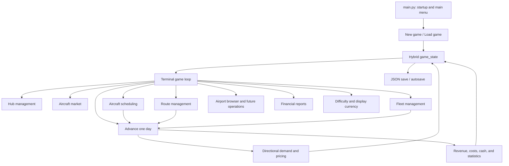

# AirlineTycoon Architecture

> Canonical product architecture, design memory, and implementation status for Airline Tycoon.
>
> Last reconciled with the codebase: 2026-07-20

## Purpose

This document preserves the game's long-term ideas while clearly separating them from what is playable today. It combines the earlier project context, master notes, clean development notes, schema references, and the current codebase.

When documents disagree, use this order of authority:

1. Current tested code for present behavior.
2. Data templates for persistent schema direction.
3. This document for product architecture and roadmap.
4. Older brainstorming documents for historical context.

## Status legend

- [x] **Implemented** — playable core behavior exists and is tested or exercised.
- [ ] **Partial / scaled** — a useful version exists, but named pieces are still missing.
- [ ] **Planned** — designed but not meaningfully implemented.
- [ ] **Deferred vision** — deliberately postponed until the offline core is mature.

## Executive snapshot

Airline Tycoon is currently a terminal-first, Philippines-playable airline management game. The essential loop works: create an airline, choose a hub, buy aircraft, create directional routes, build schedules, advance days, carry passengers, pay operating costs, earn or lose cash, and inspect basic reports.

The project follows one guiding principle:

> Build the playable game first, then scale each system without replacing its foundation.

Current milestone: **scaled playable 1.0 foundation**.

The game is not feature-complete 1.0 yet. Scheduling, airport operations, fleet lifecycle depth, demand connections, reporting history, and interface polish remain the main gaps.

## Core gameplay loop

- [x] Create a new airline and CEO.
- [x] Choose the starting hub.
- [x] Buy and register aircraft.
- [x] Create linked directional routes.
- [x] Set route fares.
- [x] Schedule passenger flights.
- [x] Advance an in-game day.
- [x] Generate passengers, revenue, operating costs, and profit.
- [x] Update airline, route, and aircraft statistics.
- [x] Save, autosave, and load games.
- [x] Inspect latest-day and per-route reports.
- [ ] **Partial:** expand through additional hubs and airports. Basic hub acquisition exists; licenses, slots, facility economics, and operational constraints are missing.
- [ ] **Partial:** manage schedules as a true weekly network. The scheduler creates all-seven-day patterns; per-day editing and deletion are missing.

## Architectural principles

- Modular packages grouped by gameplay responsibility.
- Hybrid persistent `game_state` with an active airline selected by `current_focus`.
- Aircraft-centric schedules as the operational source of truth.
- Route-centric schedule mirrors for route dashboards and reporting.
- USD as the internal accounting currency.
- Display currency conversion must never mutate stored USD values.
- Data-driven aircraft, airport, and lessor catalogs.
- Shared helpers live in `game/utils`; package-specific logic stays in its package.
- Persistent fields should extend a deliberate schema instead of appearing ad hoc.
- Terminal gameplay remains the proving ground before Kivy becomes the primary UI.
- Offline play must remain complete and must not be blocked by future online systems.

## Runtime architecture



## Package responsibilities

| Area | Primary location | Responsibility | Current status |
|---|---|---|---|
| Startup | `main.py` | Console setup, new/load menu | Implemented |
| State and saves | `game/game_state.py` | Default state, active airline, save/load/autosave | Implemented, migration remains basic |
| Game loop | `game/game_loop.py` | Dashboard and system navigation | Implemented terminal UI |
| Aircraft market | `game/aircraft_market/` | Purchase, used market, lessor browsing | Partial |
| Fleet | `game/fleet_management/` | Overview, details, sale, maintenance entry points | Partial |
| Hubs | `game/hub_management/` | Hub acquisition, views, assigned assets | Partial |
| Airports | `game/airports/` | Browse airport reference data | Partial/stub operations |
| Routes | `game/route_management/` | Route pairs, fares, distance, demand preview | Implemented core |
| Scheduling | `game/scheduling/` | Rotation building, conflicts, continuity, deadheads | Implemented scaled core |
| Simulation | `game/simulation/daily_tick.py` | Daily flight and financial execution | Implemented scaled core |
| Economy | `game/economy/` | Currency and demand rules | Implemented scaled core |
| Reports | `game/financial_reports/` | Latest daily and cumulative route reports | Partial |
| GUI | `game/gui/` | Kivy application scaffolding | Stub |
| Utilities | `game/utils/` | Rendering, data loading, time, saves, registration | Implemented support layer |
| Tests | `tests/` | Economy, simulation, scheduling, deadheads | 24 passing tests at reconciliation |

## Persistent game-state direction

The game uses a hybrid structure so a single-airline game can later grow into an airline group.

```text
player_info
  ceo_name
  airline_name
  level
  current_focus

settings
  difficulty
  base_currency = USD
  display_currency

game_time
  current_date

aircraft_reference
  model specifications loaded for runtime use

airline_list
  <airline name>
    hubs
    fleet
    routes
    finances
      cash_on_hand
      total_revenue
      total_expenses
      total_profit
      daily_history
    licenses
    subsidiaries            # future
    parent_company           # future subsidiary field
    ai_mode / ai_coo / ai_ceo # future
```

### State rules

- `player_info.current_focus` identifies the airline currently being managed.
- Airline-specific hubs, fleet, routes, and finances belong under `airline_list`.
- Aircraft schedules are primary operational records.
- Route schedules are mirrors for lookup and presentation.
- New persistent systems need explicit defaults and save compatibility.
- Legacy routes are currently upgraded at runtime with population, fares, distance, and demand when possible.
- A formal versioned migration pipeline is still needed before the save schema expands further.

## Economy and currency

### Current implementation

- [x] USD is the sole internal accounting currency.
- [x] Display conversion supports a fixed settings table without changing stored values.
- [x] Dashboard, purchases, reports, and route fares use shared money formatting in the main flows.
- [ ] **Partial:** some older menus and lessor data still contain legacy peso labels or values and need normalization.
- [ ] **Planned:** configurable conversion-table editing.
- [ ] **Planned:** historical exchange rates or fluctuating foreign exchange.

### Fare baseline

Suggested 2020 ticket fares use distance:

```text
Economy = distance_km × USD 0.12
Business = Economy × 2.2
First = Economy × 5.0
```

Future inflation should adjust the baseline rather than scattering new hardcoded prices across systems.

## Demand architecture

### Current scaled model

Demand is directional: `MNL → DVO` is intentionally different from `DVO → MNL`.

```text
population_score = origin_population × 0.65
                 + destination_population × 0.35

distance_factor = max(1, sqrt(distance_km / 500))

base_daily_demand = population_score / 7,500 / distance_factor
```

Difficulty multipliers:

| Difficulty | Demand multiplier | Price behavior |
|---|---:|---|
| Easy | 1.50 | No price sensitivity |
| Normal | 1.00 | Moderate reward/penalty |
| Hard | 0.70 | Stronger price sensitivity |
| Extreme | 0.50 | Strongest price sensitivity |

The scheduler displays directional demand, assigned seats, and demand left so capacity is not assigned blindly. Multiple flights in one direction share one daily demand pool.

### Known limitations

- [ ] **Partial:** population data currently mixes city and metropolitan catchments, so comparisons are not fully consistent.
- [ ] **Partial:** the 7,500 normalizer is a playability tune, not a final calibrated market model.
- [ ] **Missing:** connection demand and hub-and-spoke feed.
- [ ] **Missing:** frequency and departure-time attractiveness.
- [ ] **Missing:** tourism, business activity, luxury score, reputation, and airline attractiveness.
- [ ] **Missing:** seasonality, holidays, special events, and world events.
- [ ] **Missing:** competing airlines and shared market demand.
- [ ] **Missing:** class-specific demand allocation using route type.

### Intended mature model

```text
Total route demand
  = Local origin-and-destination demand
  + Connecting demand produced by valid itinerary banks

Adjusted captured demand
  = Total route demand
  × price modifier
  × frequency/timing modifier
  × reputation modifier
  × tourism/business/luxury modifiers
  × seasonality/event modifier
  × competition share
  × difficulty modifier
```

Hub-and-spoke demand must come from real scheduled connections. An inbound flight should only feed an outbound flight when the connection time is valid, capacity exists, and the itinerary is competitive. A destination with more useful connections should therefore become more valuable without receiving arbitrary free demand.

## Route management

- [x] Select origins and destinations from airport data.
- [x] Calculate great-circle distance.
- [x] Create linked forward and reverse directional records.
- [x] Store route-pair and reverse-route identifiers.
- [x] Calculate suggested Economy, Business, and First fares.
- [x] Permit manual per-route fare editing.
- [x] Preview numerical demand in both directions before creating a route.
- [x] Display existing routes and basic statuses.
- [ ] **Partial:** routes can originate away from a hub, but licensing and airport-access rules are not enforced comprehensively.
- [ ] **Missing:** route closure/deletion workflow and safe removal of dependent schedules.
- [ ] **Missing:** route-level airport fees, slot requirements, and runway/aircraft compatibility.
- [ ] **Missing:** route feasibility based on competition, facilities, range by assigned fleet, and traffic rights.
- [ ] **Missing:** connecting itinerary graph and network contribution metrics.

## Scheduling architecture

### Current behavior

- [x] Aircraft-centric schedules are the primary operational source.
- [x] Route-centric mirrors are written for passenger schedules.
- [x] Flight duration uses route distance and aircraft cruise speed.
- [x] A 30-minute turnaround block is included in planning.
- [x] Overlap conflicts are detected.
- [x] Multiple useful openings are suggested, prioritizing time after existing flying.
- [x] A conflicting requested time offers the next available time for confirmation.
- [x] Route pairs appear once in the planning list.
- [x] The flight viewer shows each aircraft rotation by weekday and numeric departure time, with sequence numbers and deadhead labels.
- [x] Direction can be inferred from the aircraft's current location.
- [x] Consecutive flights must connect geographically; aircraft cannot teleport.
- [x] Out-and-back scheduling is supported when the reverse route exists.
- [x] Positioning/deadhead flights can bridge an aircraft to the required origin.
- [x] Deadheads require an explicit warning and confirmation.
- [x] Deadheads obey aircraft range, carry no passengers, earn no revenue, and incur operating costs.
- [x] Deadheads are labeled in schedule and daily-result displays.
- [x] Demand, scheduled seats, and demand left are shown by direction.

### Still missing or scaled

- [ ] **Partial:** new patterns are currently applied to all seven days; the player cannot choose individual operating days.
- [ ] **Missing:** edit, move, copy, cancel, and delete scheduled flights.
- [ ] **Missing:** stable `flight_id` values to synchronize edits between aircraft and route indexes.
- [ ] **Missing:** a formal ready-time field separating arrival, taxi, and turnaround.
- [ ] **Missing:** weekly boundary continuity—Sunday location should feed Monday rather than assuming a daily reset at the assigned hub.
- [ ] **Missing:** overnight flights and date rollover.
- [ ] **Missing:** airport slots, curfews, runway restrictions, gates, and congestion.
- [ ] **Missing:** maintenance blocks, crew duty, delays, cancellations, and disruption recovery.
- [ ] **Missing:** manual positioning choice and a detailed deadhead cost preview before confirmation.
- [ ] **Missing:** interactive-menu integration tests; current tests target the planning rules and simulation helpers.

## Daily simulation

- [x] Advance the game date by one day.
- [x] Execute active, delivered aircraft schedules for the current weekday.
- [x] Share directional demand across multiple same-day flights.
- [x] Allocate passengers up to available seats.
- [x] Calculate passenger revenue from cabin fares.
- [x] Calculate fuel expense from burn, time, and fuel price.
- [x] Calculate a basic non-fuel seat-kilometer expense.
- [x] Charge deadhead operating costs without passengers or revenue.
- [x] Update cash, cumulative airline finances, daily history, route statistics, and aircraft statistics.
- [ ] **Missing:** salaries, airport and navigation fees, maintenance accrual, lease payments, insurance, taxes, and financing.
- [ ] **Missing:** depreciation and aircraft market-value changes.
- [ ] **Missing:** random operational delays, cancellations, weather, and failures.
- [ ] **Missing:** cargo revenue and payload/range tradeoffs.

## Financial reporting

- [x] Latest daily report: flights, passengers, seats, load factor, revenue, fuel, other costs, profit, and closing cash.
- [x] Per-route cumulative report: directional demand, fares, flights, passengers, load factor, revenue, expenses, profit, and profit per flight.
- [ ] **Partial:** daily history is stored but only the latest day is displayed.
- [ ] **Missing:** historical trends and date-range comparison.
- [ ] **Missing:** route-by-route daily history rather than cumulative totals only.
- [ ] **Missing:** forecast/projection reports for looking into the future.
- [ ] **Missing:** cash-flow statement, profit-and-loss statement, balance sheet, and categorized cost ledger.
- [ ] **Missing:** fleet, hub, and network profitability reports.

## Fleet and aircraft market

### Implemented core

- [x] Data-driven aircraft catalogs from Airbus, Boeing, and De Havilland Canada data.
- [x] Buy aircraft and assign registration numbers.
- [x] Assign purchased aircraft to a hub.
- [x] Store cabin layout and aircraft statistics.
- [x] View fleet overview and aircraft details.
- [x] Sell/remove aircraft through the fleet interface.
- [x] Browse used-aircraft dummy listings.
- [x] Browse data-driven lessor companies and offers.

### Partial and missing

- [ ] **Partial:** maintenance screens exist, but maintenance does not yet change condition, consume time, or charge money.
- [ ] **Partial:** lessor offers are browsable, but signing leases and rent-to-own contracts is not implemented.
- [ ] **Partial:** used-market active bidding is a placeholder.
- [ ] **Partial:** cabin layouts exist, but interactive seat reconfiguration is not implemented.
- [ ] **Missing:** delivery lead times and order backlog.
- [ ] **Missing:** aircraft aging, condition decay, cleanliness effects, reliability, and dispatch availability.
- [ ] **Missing:** A/B/C/D checks, overhaul programs, and maintenance history.
- [ ] **Missing:** lease payments, deposits, return conditions, and ownership transfer.
- [ ] **Missing:** configurable seat width, pitch, comfort, and their reputation/demand effects.
- [ ] **Missing:** cargo/passenger balance and freighter conversion.
- [ ] **Missing:** payload-range limitations and runway performance.

## Hubs and airports

- [x] Choose a starting hub.
- [x] Store hubs by country and IATA code.
- [x] View owned hubs, assigned planes, routes, and available statistics.
- [x] Add and remove hubs through current management flows.
- [x] Browse airport reference details.
- [ ] **Partial:** airport ownership can be toggled, but no purchase price or financial transaction is applied.
- [ ] **Partial:** facility states can be viewed, but upgrades and effects are placeholders.
- [ ] **Missing:** country/route licenses and traffic rights.
- [ ] **Missing:** slot purchasing, slot consumption, and slot scarcity.
- [ ] **Missing:** landing, parking, passenger, and navigation fees.
- [ ] **Missing:** runway, stand, terminal, curfew, and congestion enforcement.
- [ ] **Missing:** lounges, maintenance bases, cargo facilities, fuel depots, and storage.
- [ ] **Current scope:** the active airport dataset is Philippines-focused; global expansion data must be restored or added deliberately.

## Fuel and inflation

- [x] A fixed fuel price feeds current operating costs.
- [ ] **Planned:** one global yearly inflation engine affecting fares, aircraft, fuel, salaries, fees, maintenance, and taxes.
- [ ] **Planned:** historical and future price curves.
- [ ] **Planned:** fuel volatility, potentially up to approximately ±50% during major market movement.
- [ ] **Planned:** hub fuel tanks and storage facilities.
- [ ] **Planned:** bulk fuel purchasing, market timing, hedging, and airline-influence discounts.
- [ ] **Planned:** world events affecting fuel and broader economic conditions.

## Progression and prestige

- [ ] **Planned:** player levels that unlock broader pricing and management tools.
- [ ] **Planned:** star-based prestige milestones.
- [ ] **Planned:** prestige influence on premium demand and airline attractiveness.
- [ ] **Planned:** prestige credits/gems for aircraft, lounges, and upgrades.
- [ ] **Planned:** manual per-route pricing at early levels, then regional, fleet-wide, and automated inflation-aware controls.

## Subsidiaries and AI management

The hybrid state deliberately leaves room for airline groups.

- [ ] **Planned:** create passenger, regional, express, or cargo subsidiaries.
- [ ] **Planned:** separate subsidiary finances with parent ownership.
- [ ] **Planned:** fleet and cash transfers between parent and subsidiaries.
- [ ] **Planned:** `parent_company` and control rules.
- [ ] **Planned:** AI COO with player-created task queues.
- [ ] **Planned:** AI CEO with strategies such as low-cost, premium, regional, or cargo focus.
- [ ] **Planned:** optional autonomous management and control-lock rules.
- [ ] **Planned:** Billie assistant for route suggestions, pricing optimization, and feasibility analysis. Current Billie functions are placeholders.
- [ ] **Planned:** independent AI competitor airlines using the same economic rules.

## GUI and map vision

- [x] Kivy was selected as the intended GUI framework.
- [ ] **Stub:** a basic Kivy application/dashboard skeleton exists.
- [ ] **Planned:** replace terminal screens only after backend systems are stable.
- [ ] **Planned:** interactive Mercator world map.
- [ ] **Planned:** airport dots, route lines, aircraft icons, and real-time movement.
- [ ] **Planned:** endless horizontal/wraparound map scrolling.
- [ ] **Planned:** performance suitable for hundreds of active flights.
- [ ] **Planned:** desktop and mobile-friendly layouts.

## Online vision

Online systems must never weaken or delay the standalone game.

- [ ] **Deferred vision:** private multiplayer worlds.
- [ ] **Deferred vision:** alliances and shared airline groups.
- [ ] **Deferred vision:** shared or competitive demand markets.
- [ ] **Deferred vision:** MMO-style persistent worlds.
- [ ] **Deferred vision:** prestige seasons.

## Data architecture

### Aircraft data

Aircraft reference records are intended to contain:

- Manufacturer and aircraft type.
- Range, passenger capacity, payload, and cargo capacity.
- Cruise speed and fuel burn.
- Runway and crew requirements.
- Cabin dimensions and default cabin layout.
- Purchase and layout prices.
- Maintenance checks, aging, and overhaul information.
- Production dates, tags, and unlock level.
- Reconfiguration and freighter-conversion rules.

Many advanced fields exist in the templates but are not yet used by gameplay.

### Airport data

Airport reference records are intended to contain:

- IATA/ICAO identity, city, country, region, and coordinates.
- Population/catchment and city characteristics.
- Runways, stands, terminals, aircraft class, slots, and taxi time.
- Passenger/cargo infrastructure and airport fees.
- Tourism, business, luxury, regional importance, and hub potential.
- Holidays, seasonal demand, and closure seasons.
- Aircraft registration prefix.

Current gameplay primarily consumes identity, location, population, country, and registration information. Most infrastructure and demand-quality fields remain future inputs.

### Airport inclusion rules

- Prefer commercial airports serving catchments of at least 100,000 people.
- Exclude private and military-only airports.
- Use consistent metropolitan/catchment population definitions.
- Keep national/global holidays in shared event data; airport records should contain only local effects.
- Do not store route-license prices directly on airports when they can be calculated from global economic rules.

## Testing and technical health

- [x] Automated tests cover daily ticks, shared demand pools, directional demand, price sensitivity, route pairs, display currency, legacy-route repair, scheduling continuity, demand-left planning, conflict suggestions, deadhead planning, range limits, and deadhead accounting.
- [x] Current automated result at reconciliation: **24 passing tests**.
- [x] Generated Python bytecode, local saves, snapshots, and generated reference bundles are excluded from Git through `.gitignore`.
- [ ] **Missing:** tests for interactive menu input/output workflows.
- [ ] **Missing:** save/load round-trip and formal migration tests.
- [ ] **Missing:** end-to-end multi-day network scenarios.
- [ ] **Missing:** property tests for schedule invariants and financial conservation.
- [ ] **Technical debt:** several older files contain mojibake/encoding artifacts in terminal labels and comments.
- [ ] **Technical debt:** `DEV_MODE` remains enabled in the game loop.
- [ ] **Technical debt:** several modules are empty scaffolds and should either receive behavior or be explicitly documented as placeholders.

## Release checklist

### Scaled playable foundation

- [x] Philippines airport dataset.
- [x] Airline creation and starting hub.
- [x] Aircraft purchase and fleet storage.
- [x] Directional route creation and fares.
- [x] Weekly-pattern scheduling and conflict prevention.
- [x] Aircraft location continuity and confirmed deadheads.
- [x] Daily passenger and financial simulation.
- [x] Basic currency display settings.
- [x] Latest daily and per-route reports.
- [x] Save/load and autosave.

### Needed before calling terminal 1.0 complete

- [ ] Per-day schedule selection plus edit/delete workflows.
- [ ] Weekly/overnight aircraft-position continuity.
- [ ] Airport license and slot enforcement.
- [ ] Functional maintenance costs, downtime, and condition effects.
- [ ] Consistent currency labels and removal of legacy peso assumptions.
- [ ] Save-schema versioning and migration tests.
- [ ] Historical report browsing and basic forecasting.
- [ ] Terminal encoding cleanup and menu-level testing.
- [ ] Review whether the Philippines-only data and current demand scale create the intended progression pace.

## Recommended roadmap

### Next: scheduling completion

1. Add per-day operating selection.
2. Add edit, copy, cancel, and delete controls.
3. Introduce stable flight IDs.
4. Track aircraft position across day and week boundaries.
5. Display ready time, turnaround, deadhead cost, and later-flight consequences clearly.

### Then: network demand

1. Normalize airport catchment population data.
2. Separate local O&D demand from connecting demand.
3. Build valid connection windows from the real schedule.
4. Add frequency, timing, reputation, tourism, business, and seasonality modifiers.
5. Add competition only after single-airline demand is understandable.

### Then: airport and fleet economics

1. Implement licenses, slots, fees, and runway/gate limits.
2. Implement maintenance intervals, downtime, condition decay, and costs.
3. Complete lease/rent-to-own contracts and recurring payments.
4. Add salaries, insurance, taxes, depreciation, and financing.
5. Add fuel storage and inflation after the base ledger is trustworthy.

### Then: management depth

1. Historical reporting and forecasts.
2. Hub facilities, lounges, cargo, and prestige.
3. Subsidiaries and fleet/cash transfers.
4. Billie assistance and AI competitors.
5. Kivy interface and interactive map.
6. Online systems only after the standalone simulation is mature.

## Decisions to remember

- Demand must remain directional.
- More useful connections should create more demand, making hub-and-spoke networks viable.
- Connection demand must be earned through valid schedules, not added as an arbitrary destination bonus.
- Aircraft location is physical: no teleporting between routes.
- Positioning is allowed, but deadheads require confirmation and cost money without earning passenger revenue.
- Route-pair lists should avoid showing duplicate forward/reverse entries when direction can be inferred.
- Scheduling should explain conflicts and offer useful alternatives instead of only rejecting input.
- Planning screens should expose demand, assigned seats, and remaining demand.
- USD remains the accounting truth; currencies are display conversions.
- Financial history looks backward; a forecast or projection looks forward.
- Terminal-first development protects the simulation architecture from premature GUI coupling.
- Every scaled implementation should name what was deliberately omitted.
- Future features should extend the hybrid state and modular packages rather than force a rewrite.

## Document maintenance rule

Update this document whenever any of the following changes:

- A persistent schema gains or changes fields.
- A gameplay formula changes.
- A system moves from planned to partial or implemented.
- A scaled feature deliberately omits behavior.
- A major architectural boundary changes.
- A roadmap priority changes.

Do not erase deferred ideas merely because they are not part of the current milestone. Move them to the appropriate planned or deferred section and record the missing prerequisites.
